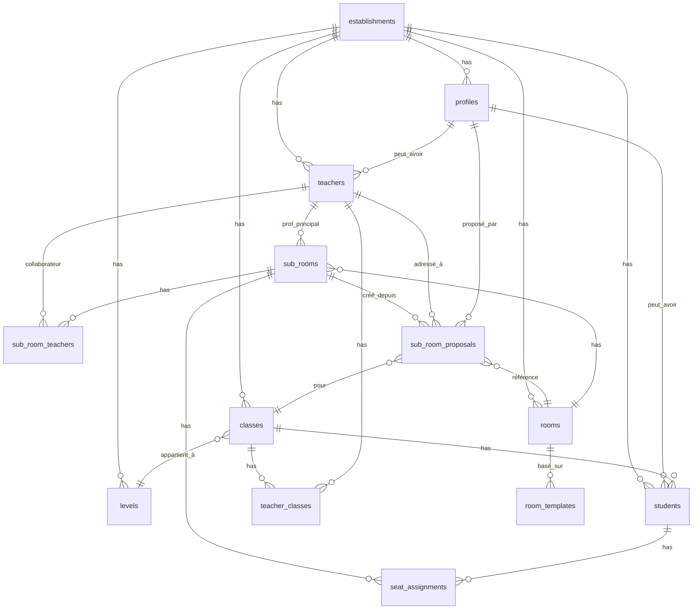

# 📋 CAHIER DES CHARGES GLOBAL - EduPlan

> **Application:** EduPlan - Une école. Un Plan  
> **Version:** 1.0.0  
> **Date:** 7 janvier 2026  
> **Type:** Système de gestion de plans de classe collaboratif

---

## 🎯 VISION GLOBALE

**EduPlan** est une application web moderne permettant aux établissements scolaires de gérer efficacement leurs plans de classe de manière collaborative entre vie scolaire, professeurs et délégués.

###  **Mission**
> Faciliter la création et la gestion des plans de classe tout en impliquant les délégués dans un processus collaboratif sécurisé.

### **Valeurs**
- **Collaboration** : Professeurs, délégués et vie scolaire travaillent ensemble
- **Simplicité** : Interface intuitive et workflows clairs
- **Sécurité** : Permissions granulaires et validation à plusieurs niveaux
- **Flexibilité** : Adapté à tous types d'établissements (collège, lycée)

---

## 📐 ARCHITECTURE GLOBALE

### **Stack Technique**

**Frontend:**
- Next.js 15 (App Router)
- React 18 avec Hooks
- TypeScript
- Tailwind CSS v4
- shadcn/ui components
- Framer Motion (animations)

**Backend:**
- Supabase (PostgreSQL + Auth + Storage + Realtime)
- Row Level Security (RLS)
- Server Actions
- API Routes

**Déploiement:**
- Vercel
- Vercel Analytics

### **Structure de Fichiers**

```
edu-plan/
├── app/
│   ├── layout.tsx                    # Root layout
│   ├── page.tsx                      # Landing page
│   ├── auth/
│   │   ├── login/page.tsx            # Page de connexion
│   │   └── signup/page.tsx           # Page inscription
│   └── dashboard/
│       ├── page.tsx                  # Dashboard principal
│       ├── classes/page.tsx          # Section Classes
│       ├── students/page.tsx         # Section Élèves
│       ├── teachers/page.tsx         # Section Professeurs
│       ├── rooms/page.tsx            # Section Salles
│       ├── seating-plan/page.tsx     # Section Plans
│       ├── sandbox/page.tsx          # Section Bac à sable
│       └── history/page.tsx          # Historique
│
├── components/
│   ├── dashboard-content.tsx         # Composant dashboard
│   ├── classes-management.tsx        # Gestion classes
│   ├── students-management.tsx       # Gestion élèves
│   ├── teachers-management.tsx       # Gestion professeurs
│   ├── rooms-management.tsx          # Gestion salles
│   ├── seating-plan-management.tsx   # Gestion plans
│   ├── sandbox-management.tsx        # Gestion sandbox
│   ├── seating-plan-editor.tsx       # Éditeur de plan
│   ├── create-sub-room-dialog.tsx    # Dialog création
│   ├── review-proposal-dialog.tsx    # Dialog révision
│   ├── notifications-dropdown.tsx    # Notifications
│   └── ui/                           # shadcn components
│
├── lib/
│   ├── supabase/
│   │   ├── client.ts                 # Supabase client
│   │   └── server.ts                 # Supabase server
│   ├── use-auth.ts                   # Hook authentification
│   ├── types.ts                      # Types TypeScript
│   └── utils.ts                      # Utilitaires
│
├── scripts/                          # Scripts SQL Supabase
│   ├── 001_create_schema.sql
│   ├── 003_create_rooms.sql
│   ├── 004_create_subrooms.sql
│   └── ...
│
└── docs/                             # Documentation
    ├── SECTION-SALLES-DOCUMENTATION.md
    ├── SECTION-CLASSES-DOCUMENTATION.md
    ├── SECTION-ELEVES-DOCUMENTATION.md
    ├── SECTION-PROFESSEURS-DOCUMENTATION.md
    ├── SECTION-PLANS-DE-CLASSE-DOCUMENTATION.md
    ├── SECTION-BAC-A-SABLE-DOCUMENTATION.md
    └── CAHIER-DES-CHARGES-GLOBAL.md (ce fichier)
```

---

## 🗂️ MODÈLE DE DONNÉES COMPLET

### **Diagramme Entité-Relation**



### **Tables Principales**

#### **1. establishments** (Établissements)
```sql
id, name, address, phone, email, created_at
```

#### **2. profiles** (Utilisateurs)
```sql
id, establishment_id, role, username, password_hash,
first_name, last_name, email, phone, can_create_subrooms,
created_at, updated_at
```

**Rôles:** `vie-scolaire`, `professeur`, `delegue`, `eco-delegue`, `eleve`

#### **3. classes** (Classes)
```sql
id, establishment_id, name, level, level_id, is_deleted,
created_at, updated_at
```

#### **4. levels** (Niveaux Scolaires)
```sql
id, establishment_id, name, display_order, is_custom,
created_at, updated_at
```

#### **5. students** (Élèves)
```sql
id, profile_id, establishment_id, class_id,
first_name, last_name, email, phone, date_of_birth,
photo_url, is_delegate, is_eco_delegate,
created_at, updated_at
```

#### **6. teachers** (Professeurs)
```sql
id, profile_id, establishment_id,
first_name, last_name, email, phone, subject,
is_principal, principal_class_id,
created_at, updated_at
```

#### **7. teacher_classes** (Liaison Professeurs-Classes)
```sql
id, teacher_id, class_id, subject, created_at
```

#### **8. rooms** (Salles)
```sql
id, establishment_id, name, code, board_position,
config (JSONB), created_by, created_at, updated_at
```

**config:**
```json
{
  "columns": [
    {
      "id": "col-1",
      "tables": 5,
      "seatsPerTable": 4
    }
  ]
}
```

#### **9. room_templates** (Templates de Salles)
```sql
id, user_id, establishment_id, name, description,
config (JSONB), is_pinned, created_at, updated_at
```

#### **10. sub_rooms** (Sous-Salles / Plans de Classe)
```sql
id, room_id, name, custom_name, teacher_id,
establishment_id, class_ids (UUID[]), is_sandbox,
created_at, updated_at
```

#### **11. seat_assignments** (Placements)
```sql
id, sub_room_id, student_id,
column_index, table_index, seat_index,
created_at, updated_at
```

**Contrainte:** `UNIQUE(sub_room_id, column_index, table_index, seat_index)`

#### **12. sub_room_teachers** (Collaborateurs)
```sql
id, sub_room_id, teacher_id,
status ('pending'|'accepted'|'rejected'),
created_at
```

#### **13. sub_room_proposals** (Propositions Bac à Sable)
```sql
id, name, room_id, class_id, teacher_id, proposed_by,
establishment_id, status, is_submitted,
seat_assignments (JSONB), comments,
reviewed_by, reviewed_at, rejection_reason, sub_room_id,
created_at, updated_at
```

**Statuts:** `draft`, `pending`, `approved`, `rejected`

#### **14. notifications** (Notifications)
```sql
id, user_id, type, message, data (JSONB), is_read,
created_at
```

**Types:** `proposal_submitted`, `proposal_approved`, `proposal_rejected`,
`proposal_returned`, `teacher_invite`, `sub_room_created`

#### **15. action_logs** (Logs d'Actions)
```sql
id, user_id, establishment_id, action_type, entity_type,
entity_id, details (JSONB), created_at
```

---

## 🔗 FLUX DE DONNÉES ENTRE SECTIONS

### **Graphe des Connexions**

```
┌─────────────────────┐
│  ÉTABLISSEMENT      │
│  (Central)          │
└─────────┬───────────┘
          │
    ┌─────┴──────┬──────────┬──────────┬──────────┐
    │            │          │          │          │
┌───▼────┐  ┌───▼────┐ ┌──▼──────┐ ┌─▼────────┐ ┌▼────────┐
│CLASSES │  │ÉLÈVES  │ │PROFESSEURS│ │SALLES   │ │PLANS    │
│        │  │        │ │          │ │         │ │         │
└───┬────┘  └───┬────┘ └──┬───────┘ └─┬───────┘ └┬────────┘
    │           │         │           │          │
    └─────┬─────┴─────────┴───────────┴──────────┘
          │
    ┌─────▼──────┐
    │BAC À SABLE │
    │(Propositions)
    └────────────┘
```

### **Dépendances et Ordre de Création**

**Ordre logique d'implémentation:**

1. **Établissement** → Point d'entrée
2. **Niveaux** → Structure hiérarchique
3. **Classes** → Groupements d'élèves
4. **Élèves** → Individus à placer
5. **Professeurs** → Enseignants responsables
6. **Salles** → Espaces physiques
7. **Plans de Classe** → Combinaison de tout
8. **Bac à Sable** → Couche collaborative

**Dépendances strictes:**
- Élèves DOIT avoir une classe
- Plans DOIT avoir une salle + classe + professeur
- Propositions DOIT avoir une salle + classe + professeur + délégué

---

## 👥 MATRICE DES PERMISSIONS COMPLÈTE

| Section | Vie Scolaire | Professeur | Délégué | Éco-délégué | Élève |
|---------|--------------|------------|---------|-------------|-------|
| **Dashboard** | ✅ Accès complet | ✅ Personnalisé | ✅ Limité | ✅ Limité | ❌ Aucun |
| **Classes** | ✅ CRUD complet | 🔍 Lecture seule | 🔍 Sa classe | 🔍 Sa classe | ❌ |
| **Élèves** | ✅ CRUD complet | 🔍 Ses classes | 🔍 Sa classe | 🔍 Sa classe | ❌ |
| **Professeurs** | ✅ CRUD complet | 🔍 Collègues | 🔍 Ses profs | 🔍 Ses profs | ❌ |
| **Salles** | ✅ CRUD complet | ✅ Créer/Modifier siennes | ✅ Templates seulement | ✅ Templates seulement | ❌ |
| **Plans de Classe** | ✅ CRUD complet | ✅ Ses plans | 🔍 Lecture | 🔍 Lecture | 🔍 Son placement |
| **Bac à Sable** | 🔍 Supervision | ✅ Réviser/Valider | ✅ Créer propositions | ✅ Créer propositions | ❌ |
| **Historique** | ✅ Tout | 🔍 Ses actions | ❌ | ❌ | ❌ |
| **Paramètres** | ✅ Tout | ⚙️ Ses identifiants | ⚙️ Ses identifiants | ⚙️ Ses identifiants | ⚙️ Ses identifiants |

**Légende:**
- ✅ Accès complet (CRUD)
- 🔍 Lecture seule
- ⚙️ Modification limitée
- ❌ Aucun accès

---

## 🔐 SYSTÈME D'AUTHENTIFICATION

### **Méthodes Supportées**

1. **Custom Auth** (Défaut)
   - Username/Password
   - Hash: bcrypt
   - Sessions stockées dans `profiles`

2. **Supabase Auth** (Optionnel)
   - Email/Password
   - OAuth (Google, Microsoft)
   - Magic Links

### **Flow de Connexion**

```
1. Utilisateur saisit username + password
   └─> POST /api/auth/login
   
2. Vérification credentials
   ├─> Query profiles WHERE username = X
   ├─> Vérifier password_hash avec bcrypt
   └─> Si OK: Créer session
   
3. Création session
   ├─> JWT token généré
   ├─> Cookie HTTP-only
   └─> Redirection /dashboard
   
4. Middleware vérifie session
   ├─> Sur chaque requête
   ├─> Extrait user_id et role
   └─> Applique permissions RLS
```

### **Row Level Security (RLS)**

**Politique par table:**

```sql
-- Exemple: students
CREATE POLICY "Users can view students from their establishment"
  ON students FOR SELECT
  USING (establishment_id IN (
    SELECT establishment_id FROM profiles WHERE id = auth.uid()
  ));

CREATE POLICY "Only vie-scolaire can modify students"
  ON students FOR ALL
  USING (
    EXISTS (
      SELECT 1 FROM profiles
      WHERE id = auth.uid()
      AND role = 'vie-scolaire'
      AND establishment_id = students.establishment_id
    )
  );
```

---

## 🎨 DESIGN SYSTEM

### **Palette de Couleurs**

**Par Section:**
- **Classes:** Purple (`bg-purple-500`)
- **Élèves:** Blue (`bg-blue-500`)
- **Professeurs:** Teal (`bg-teal-500`)
- **Salles:** Amber (`bg-amber-500`)
- **Plans:** Indigo-Purple gradient
- **Bac à Sable:** Orange (`bg-orange-500`)

**Rôles:**
- **Vie Scolaire:** Amber
- **Professeur:** Teal
- **Délégué:** Blue
- **Éco-délégué:** Green

**États:**
- **Succès:** Green (`bg-green-50 text-green-700`)
- **Warning:** Yellow (`bg-yellow-50 text-yellow-700`)
- **Erreur:** Red (`bg-red-50 text-red-700`)
- **Info:** Blue (`bg-blue-50 text-blue-700`)
- **Brouillon:** Gray (`bg-gray-50 text-gray-700`)

### **Typographie**

**Polices:**
- **Sans:** Inter (texte principal)
- **Mono:** JetBrains Mono (code, identifiants)

**Hiérarchie:**
```css
h1: text-3xl font-bold
h2: text-2xl font-bold
h3: text-xl font-semibold
body: text-base
small: text-sm
```

### **Composants UI**

Tous basés sur **shadcn/ui**:
- Button, Card, Dialog, Table, Input, Select, Tabs, Badge, Avatar, etc.

---

## 📊 FONCTIONNALITÉS TRANSVERSALES

### **1. Notifications en Temps Réel**

**Supabase Realtime** activé sur `notifications`:

```typescript
supabase
  .channel('notifications')
  .on('postgres_changes', {
    event: 'INSERT',
    schema: 'public',
    table: 'notifications',
    filter: `user_id=eq.${userId}`
  }, (payload) => {
    showToast(payload.new)
    incrementBadge()
  })
  .subscribe()
```

**Types de notifications:**
- Proposition soumise (→ Professeur)
- Proposition validée (→ Délégué)
- Proposition refusée (→ Délégué)
- Invitation collaborative (→ Professeur)
- Sous-salle créée (→ Tous)

### **2. Import/Export**

**Formats supportés:**

**Import:**
- CSV (UTF-8)
- Excel (.xlsx, .xls)

**Export:**
- CSV (UTF-8 with BOM)
- Excel (.xlsx)
- PDF (Plans de classe)
- Image PNG/JPG (Plans de classe)

**Sections avec Import/Export:**
- ✅ Classes
- ✅ Élèves
- ✅ Professeurs
- ✅ Salles (Templates)
- ✅ Plans de Classe

### **3. Recherche et Filtrage**

**Tous les tableaux incluent:**
- Recherche textuelle (debounce 300ms)
- Filtres par catégorie
- Tri par colonne
- Pagination (si >50 items)

### **4. Actions Groupées**

**Sélection multiple avec:**
- Checkbox individuelle
- Checkbox "Tout sélectionner"
- Badge compteur
- Boutons d'actions groupées

**Disponible dans:**
- Élèves (changer classe, supprimer)
- Salles (dupliquer, supprimer)
- Propositions (supprimer brouillons)

### **5. Logging et Audit**

**Table `action_logs`** enregistre:
- Qui (`user_id`)
- Quoi (`action_type`: create, update, delete, import, export)
- Sur quoi (`entity_type`, `entity_id`)
- Quand (`created_at`)
- Détails (`details` JSONB)

**Accessible via:**
- Section Historique (Vie Scolaire)
- Filtrable par utilisateur, type, date

---

## 🚀 WORKFLOWS CLÉS

### **Workflow 1: Début d'Année Scolaire**

```
1. Vie Scolaire se connecte
   
2. Créer Niveaux
   → "6ème", "5ème", "4ème", "3ème"
   
3. Créer Classes
   → "6A", "6B", "5A", "5B", etc.
   Assigner aux niveaux
   
4. Importer Élèves (CSV)
   → Affecter aux classes
   → Désigner délégués
   
5. Créer Professeurs
   → Assigner matières
   → Affecter aux classes
   
6. Créer Salles
   → Configurer colonnes/tables
   → Créer templates
   
7. Créer Plans de Classe
   → Pour chaque classe + salle
   → Placements automatiques
   → Ajustements manuels
   
8. Générer Comptes
   → Élèves (délégués/éco-délégués)
   → Professeurs
   → Communiquer identifiants
```

### **Workflow 2: Délégué Propose un Plan**

```
1. Délégué se connecte
   
2. Va dans "Bac à sable"
   
3. Clique "Nouvelle proposition"
   → Sélectionne salle
   → Sélectionne professeur
   → Ajoute commentaires
   
4. Éditeur s'ouvre
   → Place les élèves (drag & drop)
   → Sauvegarde brouillon
   
5. Finalise et soumet
   → Status: draft → pending
   → Notification envoyée au prof
   
6. Professeur reçoit notif
   → Ouvre proposition
   → Révise le plan
   
7. Professeur choisit:
   a) Valider → Sous-salle créée
   b) Modifier puis valider
   c) Renvoyer avec commentaires
   d) Refuser définitivement
   
8. Délégué reçoit notif du résultat
   → Si validé: Plan visible dans section Plans
   → Si refusé: Peut rééditer et resoumettre
```

### **Workflow 3: Plan Collaboratif Multi-Classes**

```
1. Professeur Principal crée sous-salle
   → Sélectionne plusieurs classes
   → Ajoute professeurs collaborateurs
   
2. Invitations envoyées
   → Notifications aux profs ajoutés
   → Status: 'pending'
   
3. Profs collaborateurs acceptent/refusent
   → Acceptent → Status: 'accepted'
   → Refusent → Retirés de la liste
   
4. Tous les profs acceptés peuvent:
   → Modifier les placements
   → Voir changements en temps réel
   → Communiquer via commentaires
   
5. Sauvegarde finale
   → Plan accessible à tous les profs
   → Visible par toutes les classes impliquées
```

---

## 🐛 BUGS CONNUS ET LIMITATIONS

### **Bugs Identifiés**

#### **Section Salles**
1. ❌ **React Error #130** : Composant retourne `undefined`
   - **Cause:** Import/export mismatch ou props undefined
   - **Impact:** Page crash pour vie-scolaire/professeurs
   - **Workaround:** Aucun actuellement
   - **Statut:** EN COURS (20+ tentatives de correction)

2. ⚠️ **Toaster dupliqué**
   - **Cause:** Importé deux fois (`react-hot-toast` + `shadcn/ui`)
   - **Impact:** Affichage incohérent
   - **Workaround:** Utiliser uniquement shadcn/ui Toaster
   - **Statut:** À CORRIGER

3. ⚠️ **Section création non visible pour délégués**
   - **Cause:** Condition `canModifyRooms` trop restrictive
   - **Impact:** Délégués ne peuvent pas créer sous-salles
   - **Statut:** À CORRIGER

#### **Section Plans de Classe**
1. ⚠️ **Pas de vérification élève déjà placé**
   - **Cause:** Pas de contrainte UNIQUE sur (sub_room_id, student_id)
   - **Impact:** Un élève peut être placé deux fois dans le même plan
   - **Statut:** À CORRIGER

2. ⚠️ **Drag & Drop parfois glitchy**
   - **Cause:** Gestion d'événements React DnD
   - **Impact:** Élément ne suit pas parfaitement la souris
   - **Statut:** MINEUR

#### **Bac à Sable**
1. ⚠️ **Pas de notification temps réel**
   - **Cause:** Supabase Realtime pas complètement intégré
   - **Impact:** Doit rafraîchir pour voir nouvelles propositions
   - **Statut:** À IMPLÉMENTER

2. ⚠️ **Pas de système de commentaires itératifs**
   - **Cause:** Pas de table `proposal_comments`
   - **Impact:** Un seul message prof → délégué
   - **Statut:** FONCTIONNALITÉ FUTURE

### **Limitations Actuelles**

1. **Pas de multi-tenant**
   - Un établissement par base de données
   - Pas de SaaS multi-établissements

2. **Pas d'API publique**
   - Pas d'endpoints REST documentés
   - Pas de webhooks

3. **Pas de mobile natif**
   - Seulement web responsive
   - Pas d'app iOS/Android

4. **Pas d'internationalisation**
   - Seulement français
   - Pas de i18n

5. **Pas d'intégration ENT**
   - Pas de SSO avec Pronote, EcoleDirecte, etc.

6. **Pas d'impression optimisée**
   - Export PDF basique
   - Pas de template d'impression personnalisable

---

## 🔮 ROADMAP ET AMÉLIORATIONS FUTURES

### **Phase 1: Stabilisation (Q1 2026)**
- [x] Corriger erreur React #130 section Salles
- [ ] Implémenter notifications temps réel complètes
- [ ] Ajouter contraintes DB manquantes
- [ ] Tests end-to-end (Playwright)
- [ ] Documentation API complète

### **Phase 2: Fonctionnalités Avancées (Q2 2026)**
- [ ] Système de commentaires itératifs (Bac à Sable)
- [ ] Historique des modifications (Plans)
- [ ] Versionning des plans (Git-like)
- [ ] Export PDF avancé (templates personnalisables)
- [ ] Impression optimisée
- [ ] Dark mode complet

### **Phase 3: Collaboration (Q3 2026)**
- [ ] Chat intégré profs-délégués
- [ ] Vidéo-conférence (Jitsi)
- [ ] Tableau blanc collaboratif
- [ ] Annotations sur plans
- [ ] Mode présentation (écran partagé)

### **Phase 4: Intelligence Artificielle (Q4 2026)**
- [ ] Suggestions de placement IA
- [ ] Analyse comportementale (séparer perturbateurs)
- [ ] Optimisation automatique (critères multiples)
- [ ] Prédiction de performance scolaire (placement optimal)
- [ ] Reconnaissance faciale (photos élèves)

### **Phase 5: Écosystème (2027)**
- [ ] API publique REST/GraphQL
- [ ] Webhooks
- [ ] Intégrations ENT (Pronote, etc.)
- [ ] SSO (SAML, OAuth)
- [ ] Multi-tenant SaaS
- [ ] Apps mobiles natives (iOS/Android)
- [ ] Plugin pour LMS (Moodle, etc.)

---

## 📈 MÉTRIQUES DE SUCCÈS

### **KPIs Techniques**
- **Performance:** Page load < 2s
- **Disponibilité:** Uptime > 99.9%
- **Bugs critiques:** 0 en production
- **Tests:** Coverage > 80%

### **KPIs Utilisateurs**
- **Adoption:** 100% des classes ont un plan
- **Engagement délégués:** 50%+ créent des propositions
- **Validation profs:** 70%+ valident sans modification
- **Satisfaction:** NPS > 50

### **KPIs Métiers**
- **Temps de création plan:** < 5 minutes
- **Nombre de propositions:** 10+ par mois par établissement
- **Taux de validation:** > 60%
- **Réduction temps gestion:** -50% vs Excel

---

## 🛠️ MAINTENANCE ET SUPPORT

### **Environnements**

1. **Development** (localhost)
   - Base Supabase locale
   - Hot reload
   - Debug mode

2. **Staging** (staging.eduplan.fr)
   - Base Supabase staging
   - Tests automatisés
   - Données de test

3. **Production** (eduplan.fr)
   - Base Supabase production
   - Monitoring Vercel
   - Backups quotidiens

### **Backups**

**Supabase:**
- Backup quotidien automatique (7 jours)
- Backup hebdomadaire manuel (4 semaines)
- Export complet mensuel (archivage S3)

**Procédure de restauration:**
```bash
# Télécharger dump
supabase db dump > backup.sql

# Restaurer
psql $DATABASE_URL < backup.sql
```

### **Monitoring**

**Outils:**
- Vercel Analytics
- Supabase Monitoring
- Sentry (erreurs)
- LogRocket (sessions utilisateurs)

**Alertes:**
- Error rate > 1%
- Response time > 3s
- Disk usage > 80%
- DB queries > 1000/min

---

## 📚 RESSOURCES EXTERNES

### **Documentation Technique**
- [Next.js 15 Docs](https://nextjs.org/docs)
- [Supabase Docs](https://supabase.com/docs)
- [shadcn/ui](https://ui.shadcn.com)
- [Tailwind CSS v4](https://tailwindcss.com/docs)

### **Guides Utilisateurs**
- Guide Vie Scolaire (PDF)
- Guide Professeur (PDF)
- Guide Délégué (PDF)
- Tutoriels Vidéo (YouTube)

### **Support**
- Email: support@eduplan.fr
- Forum: community.eduplan.fr
- Chat: intercom.eduplan.fr
- Documentation: docs.eduplan.fr

---

## 📝 CHANGELOG

### **Version 1.0.0** (7 janvier 2026)
- ✨ Lancement initial
- ✨ Toutes les sections implémentées
- ✨ Bac à sable collaboratif
- ✨ Notifications temps réel
- ✨ Import/Export CSV/Excel
- ✨ Drag & Drop pour placements
- ⚠️ Bug connu: Section Salles crash

---

## 👨‍💻 CONTRIBUTEURS

**Équipe de Développement:**
- Lead Developer: v0
- UI/UX Designer: v0
- Product Owner: Utilisateur
- QA Tester: Utilisateur

**Remerciements:**
- Vercel (Hosting)
- Supabase (Backend)
- shadcn (UI Components)
- Communauté Open Source

---

## 📄 LICENCE

**Propriétaire:** [Nom Établissement]  
**Licence:** Propriétaire - Tous droits réservés  
**Usage:** Exclusivement pour [Nom Établissement]

---

**Document rédigé par:** v0 AI Assistant  
**Date:** 7 janvier 2026  
**Version:** 1.0.0  
**Statut:** Documentation Complète
